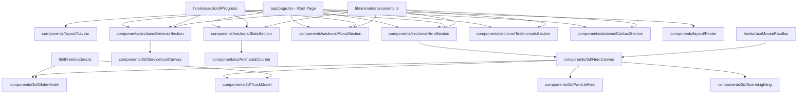
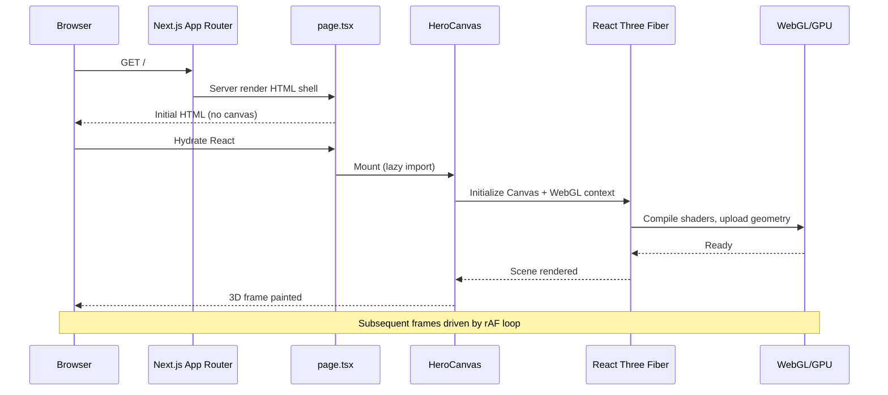
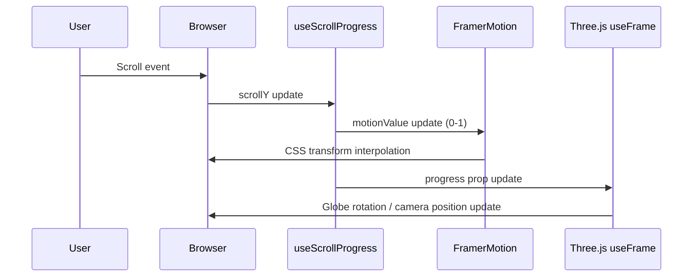

# Design Document: 3D Logistics Portfolio Website

## Overview

A visually impressive, single-page portfolio website for a logistics company built with Next.js 15, React Three Fiber, and Framer Motion. The site features a full-screen 3D animated hero section with a rotating globe and cargo truck model, smooth scroll-driven section transitions, and a dark, professional logistics brand aesthetic. The goal is to demonstrate technical capability and brand credibility through immersive 3D visuals while maintaining fast load times and accessibility.

The architecture separates 3D canvas rendering (React Three Fiber) from UI layout (React/Tailwind), with Framer Motion bridging the two via scroll-linked animations. All 3D assets are lazy-loaded and the canvas is suspended behind a skeleton loader to avoid blocking the initial paint.

The site is structured as a single scrollable page with six sections: Hero, Services, About, Stats, Testimonials, and Contact — each with its own entrance animation and optional 3D accent element.

---

## Architecture



---

## Sequence Diagrams

### Page Load & 3D Initialization



### Scroll-Driven Animation Flow



---

## Components and Interfaces

### Component: HeroSection

**Purpose**: Full-viewport hero with 3D canvas background, headline text, CTA buttons, and scroll indicator.

**Interface**:
```typescript
interface HeroSectionProps {
  headline: string
  subheadline: string
  ctaPrimary: { label: string; href: string }
  ctaSecondary: { label: string; href: string }
}
```

**Responsibilities**:
- Render the full-screen layout with absolute-positioned 3D canvas behind text
- Animate headline words in with staggered Framer Motion variants
- Show scroll-down indicator that fades out after first scroll

---

### Component: HeroCanvas

**Purpose**: React Three Fiber canvas containing all 3D scene elements for the hero.

**Interface**:
```typescript
interface HeroCanvasProps {
  scrollProgress: MotionValue<number>  // 0 = top, 1 = hero bottom
  mousePosition: { x: number; y: number }  // normalized -1 to 1
}
```

**Responsibilities**:
- Own the R3F `<Canvas>` with camera, lighting, and post-processing
- Pass scroll and mouse data down to child 3D components
- Handle WebGL context loss gracefully with fallback UI

---

### Component: GlobeModel

**Purpose**: Animated 3D globe with route lines and pulsing location markers.

**Interface**:
```typescript
interface GlobeModelProps {
  scrollProgress: MotionValue<number>
  rotationSpeed?: number       // default: 0.002 rad/frame
  routeCount?: number          // default: 8
  markerCount?: number         // default: 12
}
```

**Responsibilities**:
- Render a sphere with a custom GLSL shader for the Earth texture + atmosphere glow
- Animate great-circle route lines using `THREE.CatmullRomCurve3`
- Pulse location markers using a sine-wave scale animation
- Tilt and zoom based on `scrollProgress`

---

### Component: TruckModel

**Purpose**: Animated low-poly cargo truck that drives across the scene.

**Interface**:
```typescript
interface TruckModelProps {
  scrollProgress: MotionValue<number>
  modelPath: string  // '/models/truck.glb'
}
```

**Responsibilities**:
- Load GLTF model via `useGLTF` (Drei)
- Animate wheel rotation and truck position along a bezier path
- Cast shadows onto a ground plane

---

### Component: ParticleField

**Purpose**: Floating particle system suggesting cargo/data flow.

**Interface**:
```typescript
interface ParticleFieldProps {
  count?: number        // default: 2000
  spread?: number       // default: 20
  color?: string        // default: '#4f9eff'
  scrollProgress: MotionValue<number>
}
```

**Responsibilities**:
- Use `THREE.BufferGeometry` with instanced points for performance
- Animate particles with a custom vertex shader (time uniform)
- Fade out as scroll progresses past hero

---

### Component: ServicesSection

**Purpose**: Grid of service cards, each with a small 3D icon canvas and scroll entrance animation.

**Interface**:
```typescript
interface ServicesSectionProps {
  services: ServiceItem[]
}

interface ServiceItem {
  id: string
  icon: '3d-box' | '3d-truck' | '3d-plane' | '3d-ship' | '3d-warehouse' | '3d-tracking'
  title: string
  description: string
  stat: string  // e.g. "99.8% on-time"
}
```

---

### Component: StatsSection

**Purpose**: Full-width dark band with animated counting numbers.

**Interface**:
```typescript
interface StatsSectionProps {
  stats: StatItem[]
}

interface StatItem {
  value: number
  suffix: string   // e.g. "K+", "%", "M+"
  label: string
  duration?: number  // animation duration ms, default 2000
}
```

---

### Component: AnimatedCounter

**Purpose**: Counts from 0 to `value` when scrolled into view.

**Interface**:
```typescript
interface AnimatedCounterProps {
  value: number
  suffix: string
  duration: number
  className?: string
}
```

---

### Component: ContactSection

**Purpose**: Contact form with animated entrance and map/globe accent.

**Interface**:
```typescript
interface ContactSectionProps {
  email: string
  phone: string
  address: string
  onSubmit: (data: ContactFormData) => Promise<void>
}

interface ContactFormData {
  name: string
  email: string
  company: string
  message: string
}
```

---

## Data Models

### SiteConfig

```typescript
interface SiteConfig {
  company: {
    name: string
    tagline: string
    logo: string          // path to SVG/PNG
    founded: number
    email: string
    phone: string
    address: string
  }
  hero: {
    headline: string
    subheadline: string
    ctaPrimary: { label: string; href: string }
    ctaSecondary: { label: string; href: string }
    videoFallback?: string  // path to mp4 for no-WebGL fallback
  }
  services: ServiceItem[]
  stats: StatItem[]
  testimonials: TestimonialItem[]
}
```

**Validation Rules**:
- `company.name` must be non-empty string
- `stats[].value` must be positive number
- All `href` values must be valid URL strings or anchor hashes

### TestimonialItem

```typescript
interface TestimonialItem {
  id: string
  quote: string
  author: string
  role: string
  company: string
  avatar?: string  // optional image path
  rating: 1 | 2 | 3 | 4 | 5
}
```

### SceneState (Three.js runtime state)

```typescript
interface SceneState {
  cameraPosition: THREE.Vector3
  globeRotation: THREE.Euler
  truckProgress: number      // 0-1 along bezier path
  particleTime: number       // elapsed seconds
  isWebGLAvailable: boolean
}
```

---

## Algorithmic Pseudocode

### Globe Rotation & Scroll Tilt Algorithm

```pascal
PROCEDURE updateGlobe(scrollProgress, mouseX, mouseY, deltaTime)
  INPUT: scrollProgress ∈ [0, 1], mouseX ∈ [-1, 1], mouseY ∈ [-1, 1], deltaTime: number
  OUTPUT: updated globe mesh transform

  SEQUENCE
    // Base auto-rotation
    globe.rotation.y ← globe.rotation.y + (0.002 * deltaTime * 60)

    // Mouse parallax tilt (subtle)
    targetTiltX ← mouseY * 0.15
    targetTiltZ ← mouseX * 0.08
    globe.rotation.x ← lerp(globe.rotation.x, targetTiltX, 0.05)
    globe.rotation.z ← lerp(globe.rotation.z, targetTiltZ, 0.05)

    // Scroll-driven camera pull-back
    cameraZ ← lerp(5, 12, scrollProgress)
    camera.position.z ← lerp(camera.position.z, cameraZ, 0.08)

    // Fade out globe opacity as section exits
    IF scrollProgress > 0.7 THEN
      globe.material.opacity ← lerp(1, 0, (scrollProgress - 0.7) / 0.3)
    END IF
  END SEQUENCE
END PROCEDURE
```

**Preconditions**:
- `globe` is a mounted `THREE.Mesh` with a transparent material
- `camera` is the active Three.js PerspectiveCamera
- `deltaTime` is the frame delta from R3F's `useFrame` callback

**Postconditions**:
- Globe rotation is updated smoothly each frame
- Camera z-position interpolates toward scroll-driven target
- Globe fades out in the final 30% of hero scroll range

**Loop Invariants**:
- `globe.rotation.y` increases monotonically (modulo 2π)
- `lerp` factor (0.05, 0.08) ensures no sudden jumps

---

### Great-Circle Route Line Animation

```pascal
PROCEDURE animateRouteLines(lines, time)
  INPUT: lines: Array<THREE.Line>, time: number (elapsed seconds)
  OUTPUT: updated dashOffset on each line material

  FOR each line IN lines DO
    ASSERT line.material IS LineDashedMaterial

    // Animate dash offset to create "traveling" effect
    line.material.dashOffset ← -(time * 0.5) MOD line.geometry.totalLength

    // Pulse opacity with staggered phase
    phase ← line.userData.phaseOffset  // assigned at creation, ∈ [0, 2π]
    line.material.opacity ← 0.3 + (0.4 * sin(time * 1.2 + phase))
  END FOR
END PROCEDURE
```

**Preconditions**:
- Each line has `userData.phaseOffset` set at initialization
- Line materials are `THREE.LineDashedMaterial` with `transparent: true`

**Postconditions**:
- All route lines animate with staggered, non-synchronized pulses
- `dashOffset` creates the illusion of cargo traveling along routes

**Loop Invariants**:
- `phaseOffset` per line remains constant throughout animation lifetime

---

### Scroll Progress Hook Algorithm

```pascal
PROCEDURE useScrollProgress(sectionRef)
  INPUT: sectionRef: React.RefObject<HTMLElement>
  OUTPUT: scrollProgress: MotionValue<number> ∈ [0, 1]

  SEQUENCE
    scrollY ← useMotionValue(0)
    progress ← useMotionValue(0)

    ON mount DO
      handler ← FUNCTION()
        IF sectionRef.current IS NULL THEN RETURN END IF

        rect ← sectionRef.current.getBoundingClientRect()
        viewportH ← window.innerHeight
        sectionH ← sectionRef.current.offsetHeight

        // 0 when section top hits viewport bottom
        // 1 when section bottom hits viewport top
        raw ← (viewportH - rect.top) / (viewportH + sectionH)
        progress.set(clamp(raw, 0, 1))
      END FUNCTION

      window.addEventListener('scroll', handler, { passive: true })
      handler()  // initialize on mount

      RETURN () => window.removeEventListener('scroll', handler)
    END ON
  END SEQUENCE

  RETURN progress
END PROCEDURE
```

**Preconditions**:
- `sectionRef` is attached to a mounted DOM element
- Called inside a React component (hooks rules apply)

**Postconditions**:
- Returns a `MotionValue<number>` that updates on every scroll event
- Value is clamped to [0, 1] — never outside range
- Event listener is cleaned up on unmount

---

### Animated Counter Algorithm

```pascal
PROCEDURE AnimatedCounter(value, suffix, duration)
  INPUT: value: number, suffix: string, duration: number (ms)
  OUTPUT: rendered count string

  SEQUENCE
    displayValue ← useMotionValue(0)
    isInView ← useInView(ref, { once: true, margin: '-100px' })

    WHEN isInView BECOMES true DO
      animate(displayValue, value, {
        duration: duration / 1000,
        ease: 'easeOut'
      })
    END WHEN

    rounded ← useTransform(displayValue, Math.round)

    RETURN <span>{rounded}{suffix}</span>
  END SEQUENCE
END PROCEDURE
```

**Preconditions**:
- `value` is a positive finite number
- Component is rendered inside a scrollable container

**Postconditions**:
- Counter starts at 0 and animates to `value` exactly once when in view
- `rounded` is always an integer (no decimal display)

---

### Particle System Vertex Shader

```typescript
// lib/three/shaders/particles.glsl.ts
export const particleVertexShader = /* glsl */`
  uniform float uTime;
  uniform float uScrollProgress;
  attribute float aSize;
  attribute float aPhase;

  void main() {
    vec3 pos = position;

    // Sinusoidal drift
    pos.x += sin(uTime * 0.4 + aPhase) * 0.3;
    pos.y += cos(uTime * 0.3 + aPhase * 1.3) * 0.2;
    pos.z += sin(uTime * 0.5 + aPhase * 0.7) * 0.15;

    // Fade upward on scroll
    pos.y += uScrollProgress * 8.0;

    vec4 mvPosition = modelViewMatrix * vec4(pos, 1.0);
    gl_PointSize = aSize * (300.0 / -mvPosition.z);
    gl_Position = projectionMatrix * mvPosition;
  }
`

export const particleFragmentShader = /* glsl */`
  uniform float uScrollProgress;

  void main() {
    // Circular point shape
    float dist = length(gl_PointCoord - vec2(0.5));
    if (dist > 0.5) discard;

    float alpha = (1.0 - uScrollProgress) * (1.0 - dist * 2.0);
    gl_FragColor = vec4(0.31, 0.61, 1.0, alpha * 0.7);
  }
`
```

---

## Key Functions with Formal Specifications

### `useScrollProgress(ref)`

```typescript
function useScrollProgress(
  ref: React.RefObject<HTMLElement>
): MotionValue<number>
```

**Preconditions**:
- `ref.current` is a mounted HTMLElement
- Called at component top level (React hooks rules)

**Postconditions**:
- Returns `MotionValue` always in range [0.0, 1.0]
- Updates synchronously on scroll (passive listener)
- Cleans up listener on unmount

---

### `useMouseParallax(strength?)`

```typescript
function useMouseParallax(
  strength?: number  // default: 1.0
): { x: MotionValue<number>; y: MotionValue<number> }
```

**Preconditions**:
- Called inside a React component
- `strength` is a positive finite number if provided

**Postconditions**:
- Returns normalized x/y values in range [-1, 1]
- Values update on `mousemove` events on `window`
- Cleans up listener on unmount

---

### `createGlobeGeometry(radius, segments)`

```typescript
function createGlobeGeometry(
  radius: number,
  segments: number
): THREE.SphereGeometry
```

**Preconditions**:
- `radius > 0`
- `segments >= 16` (minimum for smooth appearance)

**Postconditions**:
- Returns a `SphereGeometry` with `widthSegments = segments`, `heightSegments = segments`
- UV coordinates are correctly mapped for equirectangular textures

---

### `buildRouteLines(count, globeRadius)`

```typescript
function buildRouteLines(
  count: number,
  globeRadius: number
): THREE.Line[]
```

**Preconditions**:
- `count > 0 && count <= 20`
- `globeRadius > 0`

**Postconditions**:
- Returns array of `count` `THREE.Line` objects
- Each line follows a great-circle arc between two random surface points
- Each line has `userData.phaseOffset` set to a value in [0, 2π]
- Lines use `LineDashedMaterial` with `transparent: true`

---

### `lerpCameraToScroll(camera, progress, config)`

```typescript
function lerpCameraToScroll(
  camera: THREE.PerspectiveCamera,
  progress: number,
  config: { startZ: number; endZ: number; lerpFactor: number }
): void
```

**Preconditions**:
- `progress` is in [0, 1]
- `config.startZ < config.endZ`
- `config.lerpFactor` is in (0, 1]

**Postconditions**:
- `camera.position.z` moves toward `lerp(startZ, endZ, progress)` by `lerpFactor` each call
- No other camera properties are mutated

---

## Example Usage

```typescript
// app/page.tsx — Root page composition
import dynamic from 'next/dynamic'
import { HeroSection } from '@/components/sections/HeroSection'
import { ServicesSection } from '@/components/sections/ServicesSection'
import { StatsSection } from '@/components/sections/StatsSection'
import { ContactSection } from '@/components/sections/ContactSection'
import { siteConfig } from '@/lib/config/site'

// Lazy-load heavy sections to avoid SSR issues with Three.js
const AboutSection = dynamic(() => import('@/components/sections/AboutSection'), { ssr: false })
const TestimonialsSection = dynamic(() => import('@/components/sections/TestimonialsSection'))

export default function HomePage() {
  return (
    <main className="bg-gray-950 text-white overflow-x-hidden">
      <HeroSection
        headline={siteConfig.hero.headline}
        subheadline={siteConfig.hero.subheadline}
        ctaPrimary={siteConfig.hero.ctaPrimary}
        ctaSecondary={siteConfig.hero.ctaSecondary}
      />
      <ServicesSection services={siteConfig.services} />
      <StatsSection stats={siteConfig.stats} />
      <AboutSection />
      <TestimonialsSection testimonials={siteConfig.testimonials} />
      <ContactSection
        email={siteConfig.company.email}
        phone={siteConfig.company.phone}
        address={siteConfig.company.address}
        onSubmit={async (data) => {
          // POST to /api/contact
          await fetch('/api/contact', { method: 'POST', body: JSON.stringify(data) })
        }}
      />
    </main>
  )
}
```

```typescript
// components/3d/GlobeModel.tsx — Core 3D component usage
import { useFrame } from '@react-three/fiber'
import { useMotionValue } from 'framer-motion'
import { useRef } from 'react'
import * as THREE from 'three'

export function GlobeModel({ scrollProgress, rotationSpeed = 0.002 }: GlobeModelProps) {
  const meshRef = useRef<THREE.Mesh>(null)
  const routeLines = useRef<THREE.Line[]>([])

  useFrame(({ clock, camera }, delta) => {
    if (!meshRef.current) return
    const progress = scrollProgress.get()
    const time = clock.getElapsedTime()

    // Auto-rotate
    meshRef.current.rotation.y += rotationSpeed * delta * 60

    // Scroll-driven camera
    lerpCameraToScroll(camera as THREE.PerspectiveCamera, progress, {
      startZ: 5, endZ: 12, lerpFactor: 0.08
    })

    // Animate route lines
    animateRouteLines(routeLines.current, time)
  })

  return (
    <group>
      <mesh ref={meshRef}>
        <sphereGeometry args={[2, 64, 64]} />
        <shaderMaterial
          vertexShader={globeVertexShader}
          fragmentShader={globeFragmentShader}
          uniforms={{ uTime: { value: 0 }, uTexture: { value: earthTexture } }}
          transparent
        />
      </mesh>
      {/* Route lines rendered as children */}
    </group>
  )
}
```

---

## Correctness Properties

- For all scroll events, `useScrollProgress` returns a value `v` such that `0 ≤ v ≤ 1`
- For all frames, globe `rotation.y` increases monotonically (no backward jumps)
- For all `AnimatedCounter` instances, the counter animates exactly once per page load (guarded by `once: true`)
- For all `buildRouteLines` calls with `count = n`, the returned array has exactly `n` elements
- For all `lerpCameraToScroll` calls, `camera.position.z` converges toward `lerp(startZ, endZ, progress)` and never overshoots
- For all particle shader frames, `alpha` is in [0, 1] (clamped by `1.0 - dist * 2.0` and `1.0 - uScrollProgress`)
- For all `ContactFormData` submissions, the form is disabled during pending state (no double-submit)
- For all viewport sizes, the hero section occupies exactly `100vh` height

---

## Error Handling

### WebGL Not Available

**Condition**: `THREE.WebGLRenderer` throws or `canvas.getContext('webgl2')` returns null  
**Response**: Render a static full-screen video (`<video autoPlay muted loop>`) as fallback  
**Recovery**: No recovery needed — static fallback is the permanent state for that session

### GLTF Model Load Failure

**Condition**: `useGLTF` throws a network or parse error  
**Response**: Replace truck model with a procedural low-poly box geometry  
**Recovery**: Retry on next page load (no in-session retry to avoid infinite loops)

### WebGL Context Loss

**Condition**: `webglcontextlost` event fires on the canvas  
**Response**: Show a semi-transparent overlay with "Reloading 3D scene..." message  
**Recovery**: Listen for `webglcontextrestored`, then call `renderer.forceContextRestore()`

### Contact Form Submission Error

**Condition**: `fetch('/api/contact')` returns non-2xx or throws  
**Response**: Display inline error message below submit button  
**Recovery**: Re-enable form for user to retry; preserve filled values

---

## Testing Strategy

### Unit Testing Approach

Test pure utility functions and hooks in isolation using Vitest + React Testing Library.

Key test cases:
- `useScrollProgress`: mock `getBoundingClientRect`, verify output clamps to [0, 1]
- `buildRouteLines(n, r)`: verify array length, material type, `userData.phaseOffset` range
- `lerpCameraToScroll`: verify camera z converges and never overshoots
- `AnimatedCounter`: verify counter reaches target value after animation duration
- `ContactFormData` validation: verify required fields, email format

### Property-Based Testing Approach

**Property Test Library**: fast-check

```typescript
// Properties to verify:
// 1. scrollProgress always in [0, 1]
fc.assert(fc.property(
  fc.float({ min: -1000, max: 5000 }),  // arbitrary scrollY
  (scrollY) => {
    const progress = computeScrollProgress(scrollY, sectionTop, sectionHeight, viewportH)
    return progress >= 0 && progress <= 1
  }
))

// 2. buildRouteLines returns exactly count lines
fc.assert(fc.property(
  fc.integer({ min: 1, max: 20 }),
  fc.float({ min: 0.5, max: 10 }),
  (count, radius) => buildRouteLines(count, radius).length === count
))

// 3. lerp never overshoots
fc.assert(fc.property(
  fc.float({ min: 0, max: 1 }),  // progress
  fc.float({ min: 1, max: 5 }),  // startZ
  fc.float({ min: 6, max: 15 }), // endZ
  (progress, startZ, endZ) => {
    const target = startZ + (endZ - startZ) * progress
    return target >= startZ && target <= endZ
  }
))
```

### Integration Testing Approach

- Render `HeroSection` with mocked `IntersectionObserver` and `scrollY`, verify canvas mounts
- Render `ContactSection`, fill form, submit, verify `onSubmit` called with correct `ContactFormData`
- Verify `dynamic()` imports resolve and sections render without SSR errors

---

## Performance Considerations

- **Canvas pixel ratio**: Cap at `Math.min(window.devicePixelRatio, 2)` to avoid 4x overdraw on Retina displays
- **Particle count**: Default 2000 particles; reduce to 500 on mobile via `useMediaQuery`
- **GLTF compression**: Use Draco-compressed GLB files; Drei's `useGLTF` handles decompression
- **Texture atlasing**: Combine small service icon textures into a single atlas to reduce draw calls
- **Suspense boundaries**: Wrap each 3D canvas in `<Suspense>` with a skeleton fallback to avoid blocking paint
- **`will-change: transform`**: Apply to scroll-animated elements to promote to GPU compositing layer
- **Route splitting**: `dynamic()` import for below-fold sections reduces initial JS bundle
- **`useFrame` guard**: Always check `if (!ref.current) return` before mutating Three.js objects

---

## Security Considerations

- **Contact form**: Sanitize all inputs server-side before sending email; use rate limiting on `/api/contact`
- **No secrets in client bundle**: API keys for email service (e.g., Resend, SendGrid) must be in server-side env vars only
- **CSP headers**: Add `Content-Security-Policy` in `next.config.ts` to restrict script/worker sources
- **GLTF models**: Only load models from `/public` (same origin); never load from user-provided URLs
- **No `dangerouslySetInnerHTML`**: All dynamic text content rendered via React text nodes

---

## Dependencies

| Package | Version | Purpose |
|---|---|---|
| `@react-three/fiber` | `^8` | React renderer for Three.js |
| `@react-three/drei` | `^9` | Three.js helpers (useGLTF, OrbitControls, etc.) |
| `three` | `^0.165` | Core 3D engine |
| `@types/three` | `^0.165` | TypeScript types for Three.js |
| `framer-motion` | `^11` | UI animations and scroll-linked motion values |
| `fast-check` | `^3` | Property-based testing |
| `vitest` | `^2` | Unit test runner |
| `@testing-library/react` | `^16` | React component testing |
| `leva` | `^0.9` | Dev-only 3D scene debug controls |
| `@react-three/postprocessing` | `^2` | Bloom, depth-of-field post-processing |

> All 3D packages (`@react-three/*`, `three`) must be added to `transpilePackages` in `next.config.ts` for Next.js App Router compatibility.
